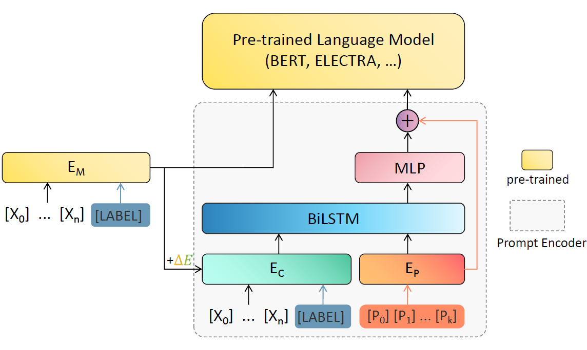
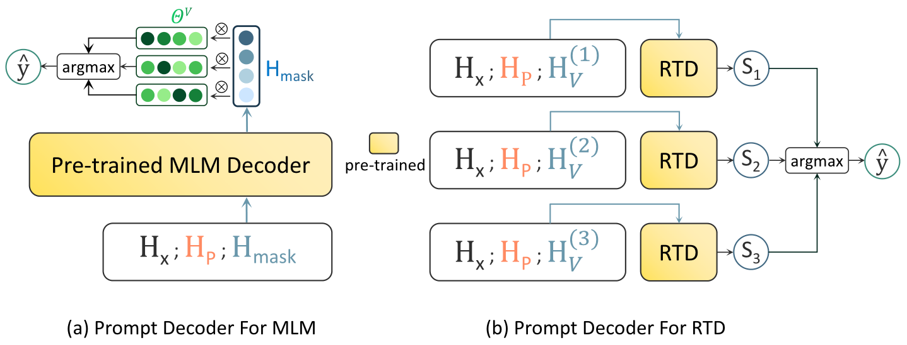

# Context-Aware Prompt

<!-- TODO: add paper title and url. -->
This repository contains code for CAP.

## Prompt Encoder


## Prompt Decoder


## Training and Evaluation
```
python main.py -c config/bert/cb.json
```

We use json to save the hyperparameters we use, please make sure the "`data_dir`" is correct before running.


## Acknowledgements
This repository is developed based on [PET](https://github.com/timoschick/pet) and [P-tuning](https://github.com/THUDM/P-tuning). Thanks to all the open source authors for their contributions to the reproduction of the paper.


## Citation
```
```
(coming soon...)
